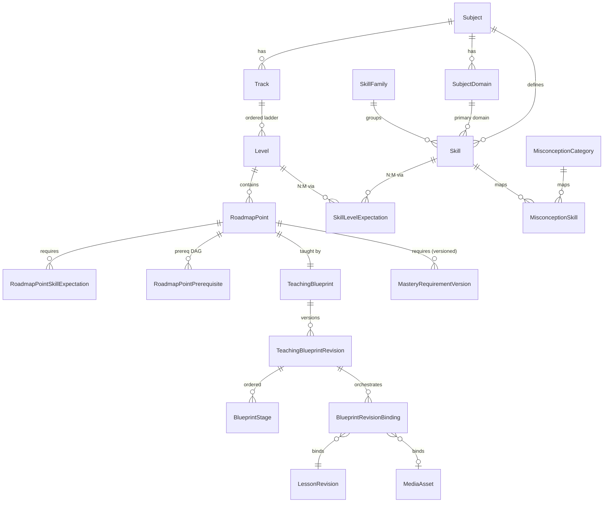
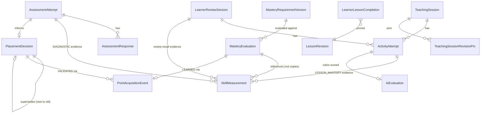
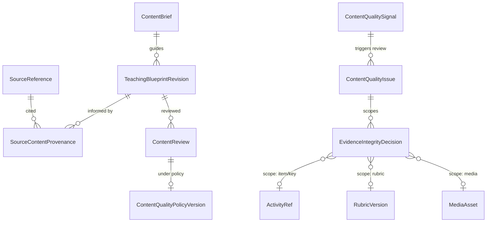
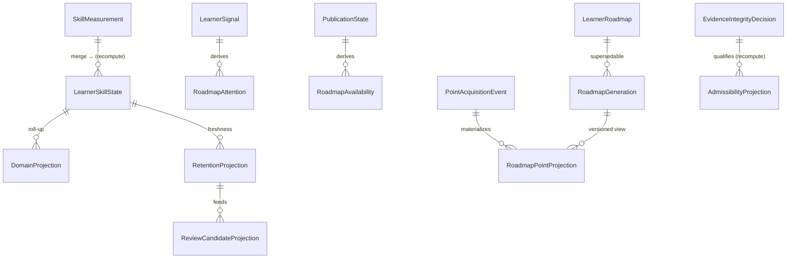

# V2 Data Model — Phase 1 (Conceptual Relational Model)

> **Status:** DESIGN / DOCUMENTATION ONLY. No Prisma schema, migration, API, runtime, test, or deployment
> change. This is the **conceptual relational model** for the reconciled six-engine V2 architecture, produced
> **before** persistence design. Exact table/column/enum names, FKs, indexes, and JSONB shapes are **deferred to
> Phase 2** (Persistence Contract / Prisma design). Names here are *conceptual* and follow the naming convention
> in `LEARNING_SYSTEM_V2.md` §7.4 (`…Decision / …Event / …Measurement / …Projection / …Signal / …Requirement /
> …Revision`).
>
> **Authority:** the reconciled cross-engine source-of-truth contract in **`LEARNING_SYSTEM_V2.md` §7** governs
> this model. No design here may reintroduce a pre-reconciliation duplicate truth (audit §29).
>
> **V1 grounding:** every "V1" reference below is the *actual* current schema (`prisma/schema/{schema,content,
> learning,core,finance}.prisma`), verified field-by-field.

---

## 1. Purpose & scope

Design the relational shape that preserves the V2 invariant:

**Immutable / historical facts  +  versioned canonical policy/content  +  recomputable current projections** —
with **exactly one authoritative owner per concept** and **no competing mutable truth** in another engine.

Scope = the learning domain (curriculum, evidence, roadmap, mastery/review, content quality). Auth, finance, and
community are touched only at the boundary where a learning fact crosses into them (rewards consume learning
facts; media is referenced by content).

## 2. Design principle (the three-substance rule)

Every entity is exactly one of:
1. **Canonical / policy** — Methodist-authored, **versioned**, immutable-once-published (curriculum, blueprints,
   requirements, policies).
2. **Historical fact / event** — **append-only**, never mutated (responses, measurements, completions,
   decisions, acquisition events, integrity decisions).
3. **Current projection / cache** — **recomputable** from (1)+(2), never an independent authority.

If a candidate seems to be two of these, it is **split** (that is the core lesson of the reconciliation).

## 3. V1 schema audit summary (what exists today)

**Content (`content.prisma`, archive-first — every parent link `onDelete: Restrict`):** `Subject`(slug unique) →
`Track`(unique[subjectId,slug]) → `Level`(`code` free-text, unique[trackId,code] & [trackId,sortOrder]) →
`Module` → `Topic` → `Lesson`(`contentKey` globally unique, `publishedRevisionId` circular @unique) →
`LessonRevision`(unique[lessonId,version]; `status` RevisionStatus; `reviewedBy`/`publishedBy`; **immutable
published**) → `Activity`(unique[lessonRevisionId,position]; `type` ActivityType; `payload` JSONB; `source`
ContentSource; **Cascade** to revision). `Skill`(subjectId; `name`; `code?`; `status` ACTIVE/ARCHIVED;
unique[subjectId,name] & [subjectId,code]; **no domain/level**). `LessonSkill`/`ActivitySkill` (bare joins,
Cascade). `LessonPrerequisite` (per-lesson DAG; self-loop CHECK). Media junction `ActivityMedia` → `MediaAsset`
(`storageKey` unique; `processingStatus`×`moderationStatus`, TD-74).

**Assessment (`learning.prisma`):** `AssessmentDefinition`(`purposeScope` DIAGNOSTIC/CHECKPOINT; `currentVersionId`
circular @unique) → `AssessmentDefinitionVersion`(unique[definitionId,versionNo]; `config` JSONB immutable) ·
`AssessmentItem`(`type`; `payload`; `skillId`; `difficulty`) · `AssessmentVersionItem`(pool membership) ·
`AssessmentAttempt`(pins `definitionVersionId`; `purpose` INITIAL_DIAGNOSTIC/CHECKPOINT/REASSESSMENT;
`engineState`/`engineVersion`/`resultSummary`) · `AssessmentResponse`(unique[attemptId,sequenceNo]; immutable
after submit).

**Evidence & progress:** `SkillMeasurement` (**append-only**; `source` enum; provenance FKs
attempt/lesson/reviewSession; `scoreBp`/`confidenceBp`/`evidenceCount`/`observedAt`/`derivationVersion`; **3
partial-unique idempotency indexes**; evidence_count>0 CHECK) → merge → `LearnerSkillState`
(`masteryScoreBp`/`confidenceBp`/`evidenceCount`/`displayLevel` cache; unique[userId,skillId]).
`ActivityAttempt`(pins `lessonRevisionId`; `reviewSessionId?`/`roadmapItemId?`; `status`
IN_PROGRESS/SUBMITTED/EVALUATED; `answer` JSONB; `clientRequestId` dedup; unique[userId,activityId,attemptNo]).
`AiEvaluation` (**XOR** response/attempt; `status`; `score`/`rubric`/`providerMetadata`/`evaluationVersion`).
`LearnerLessonProgress` (per-lesson current; pinned revision; caches). `LearnerLessonCompletion` (**append-only**
per-lesson; `completionNo`; revision kept forever). `LearnerReviewSession`(target skill+lesson; pinned
`lessonRevisionId`; one-ACTIVE partial unique) + `LearnerReviewSessionActivity`.

**Roadmap:** `LearnerRoadmap`(userId+subjectId+trackId; `status`; `sourceAssessmentAttemptId`; **no
engineVersion/generationNo/completedAt**) · `RoadmapItem`(flat `position` list; `itemType`
LESSON/REVIEW/PRACTICE/CHECKPOINT; `lessonId?` **not a FK**; single `status` scalar; Cascade) ·
`RoadmapChange`+`LearnerRecommendation` (regeneration/provenance substrate, **inert** in v1;
`Recommendation{Type,Source,Status}` incl. AI_TUTOR/PROPOSED→ACCEPTED) · `LearnerSignal`(`type` registry incl.
REVIEW_DUE/REPEATED_MISTAKE; `categoryCode` taxonomy; `status` ACTIVE/RESOLVED/EXPIRED; lifecycle
timestamps) · `Checkpoint`(module-scoped, backed by AssessmentDefinition). `DailyPlan`/`DailyPlanItem`
(versioned CURRENT/SUPERSEDED; item refs non-FK; **no generator in v1**). `LearnerLearningIntent`.

**Cross-boundary:** `MediaAsset`; `StaffAudit`(append-only, polymorphic target, no-FK); reward crossings
`RewardGrant`/`XpGrant`/`DailyMissionCompletion(Evidence)` consume learning facts via FK with dedup.

**The gap in one line:** V1 has a clean **append-only evidence substrate + single-writer merge**, but **no
domain/level/expectation, no roadmap-point (only per-lesson flat items), no blueprint, no mastery requirement,
no placement/acquisition/integrity records, and a single-scalar roadmap status** — exactly what V2 adds.

## 4. Four-layer model

### Layer A — Canonical curriculum / policy (Methodist-authored, versioned)

| Candidate | Kind | V1 | Notes |
|---|---|---|---|
| Subject | **entity (reuse)** | `Subject` | unchanged |
| **SubjectDomain** | **entity (NEW)** | — | subject-scoped domains (English: Grammar…Pronunciation); unique[subjectId, code] |
| Skill | **entity (reuse + extend)** | `Skill` | keep flat identity + `code`; **add** `primaryDomain` ref; `status` reused |
| **SkillFamily** | **entity (NEW, optional)** | — | grouping for authoring/UI/reporting; evidence still targets skills |
| **SkillLevelExpectation** | **join entity, versioned (NEW)** | — | Skill **N:M** Level with role (introduced/expected/reinforced/assessed/required-for-exit) + required evidence kinds/independence/criticality; **versioned** |
| Level (learner-facing progression config) | **entity (reuse + promote)** | `Level` | keep as ordered container; **promote** from free-text `code` to a governed ordered ladder per subject (CEFR for English) — subject config, not engine enum |
| **RoadmapPoint** | **entity (NEW)** | — | canonical pedagogical unit ≠ Lesson (§7) |
| **RoadmapPointPrerequisite** | **join entity (NEW)** | (`LessonPrerequisite` is per-lesson) | point-level DAG |
| **RoadmapPointSkillExpectation** | **join entity (NEW)** | — | point ↔ skill/expectation, with required/supporting/optional role |
| **TeachingBlueprint** | **entity (NEW)** | — | blueprint identity per point |
| **TeachingBlueprintRevision** | **immutable revision (NEW)** | (`LessonRevision` philosophy reused) | versioned; orchestrates a content set (§8) |
| **BlueprintRevisionBinding** | **join entity (NEW)** | — | revision ↔ approved `LessonRevision`/activity/media revisions + stage/order |
| **MasteryRequirement (+version)** | **entity + immutable version (NEW)** | — | one authoring home (§10); references expectations/points |
| **MisconceptionCategory** | **entity (NEW)** | (`LearnerSignal.categoryCode` registry) | canonical taxonomy |
| **MisconceptionSkill** | **join entity (NEW)** | — | taxonomy ↔ skill |
| Placement threshold policy | **versioned policy config (NEW)** | (`AssessmentDefinitionVersion.config` is per-assessment) | a versioned policy row + JSONB config |
| Mastery-derivation / review / content-quality / evidence-integrity policies | **versioned policy config (NEW)** | `derivationVersion`/`review-*-v1` are strings today | version-row + JSONB config; referenced by facts |
| Level/CEFR system per subject | **config on Subject/Level (reuse+extend)** | `Level` | generic; English = CEFR |

### Layer B — Immutable learner history / events (append-only)

| Candidate | Kind | V1 | Notes |
|---|---|---|---|
| AssessmentAttempt / placement evidence | **event (reuse)** | `AssessmentAttempt`/`AssessmentResponse` | pins version; add REASSESSMENT flows |
| **PlacementDecision** | **immutable versioned decision (NEW)** | (`resultSummary` cache only) | §11 |
| Learner response / ActivityAttempt | **event (reuse + extend)** | `ActivityAttempt` | **add** evidence-kind, independence, hint/retry, expectation-version, rubric refs (or via linked evidence, §14) |
| **TeachingSession** | **event (NEW)** | (`LearnerLessonProgress` is per-lesson current) | per-point session, pins blueprint revision **set** (§8/§12) |
| **TeachingSessionRevisionPin** | **join (NEW)** | — | session ↔ pinned content revisions (reproducibility) |
| LearnerLessonCompletion | **append-only fact (reuse)** | `LearnerLessonCompletion` | per-lesson; never faked by validation |
| SkillMeasurement | **append-only evidence (reuse + extend)** | `SkillMeasurement` | keep append-only + idempotency; **add** evidence-kind/independence/expectation-version/task-revision metadata (§14) |
| **PointAcquisitionEvent** | **append-only event (NEW)** | — | LEARNED/VALIDATED + provenance; **Roadmap-written** (§12) |
| ReviewSession | **event (reuse + extend)** | `LearnerReviewSession` | add productive review + richer pin |
| **MisconceptionObservation** | **append-only event (NEW)** | — | one datum; accumulation → signal (§16) |
| LearnerSignal | **interpretation w/ lifecycle (reuse)** — **NOT** raw immutable evidence | `LearnerSignal` | actionable cause (`ACTIVE→RESOLVED/EXPIRED`, changing `strength`/`lastSeen`); **points back to** immutable observations/evidence; ≠ Roadmap Attention (§15). The immutable facts it accumulates from are `MisconceptionObservation`/measurements/review outcomes. |
| ~~EvidenceIntegrityDecision~~ → **belongs to Layer C** | authored by Content Quality; **not** a learner-history row (§14) | — | its canonical home is Layer C below; learner Layer B keeps only response/attempt/measurement, **untouched** by an incident |
| Reassessment / history | **event (reuse)** | new `AssessmentAttempt` + new `PlacementDecision` | supersede decision, keep evidence |

**Fact vs interpretation within Layer B.** The **immutable observations/facts** are responses,
`SkillMeasurement`, `MisconceptionObservation`, review outcomes, and placement evidence — append-only, never
mutated. **`LearnerSignal` is not one of these**: it is an **actionable interpretation with a lifecycle**
(`ACTIVE→RESOLVED/EXPIRED`, mutable `strength`/`lastSeen`) that **points to** the immutable facts. Phase 2 may
persist it as (A) a lifecycle-bearing signal row + an immutable observation/event history, or (B) an
event-sourced representation — **not decided here**. **Roadmap Attention remains a derived consumer of active
signals/causes** (§15). And **`EvidenceIntegrityDecision` is authored in Layer C, not Layer B** (§14/Layer C) —
listed above only to point there.

### Layer C — Versioned content-quality / authoring facts

| Candidate | Kind | V1 | Notes |
|---|---|---|---|
| **ContentBrief** | **entity (NEW)** | — | pre-draft spec |
| **SourceReference** | **entity (NEW)** | — | research/source provenance |
| **SourceContentProvenance** | **join (NEW)** | — | source ↔ content revision (claims informed) |
| **ContentReview (+checklist result)** | **entity (NEW)** | (`RevisionStatus` DRAFT→REVIEW→PUBLISHED reused) | multidimensional review record |
| Approval provenance | **reuse + extend** | `StaffAudit` + `LessonRevision.{reviewedBy,publishedBy}` | who/policy-version/when |
| **ContentQualityIssue** | **entity, lifecycle (NEW)** | — | OBSERVED→…→RESOLVED |
| **ContentQualitySignal** | **append-only aggregate (NEW)** | (`LearnerSignal` is per-learner) | content-level, not learner-level (§16) |
| Content withdrawal / deprecation | **reuse + extend** | `RevisionStatus.ARCHIVED` + `LessonStatus` | + urgent-withdrawal marker |
| **EvidenceIntegrityDecision** | **canonical home = Layer C** (immutable versioned decision, NEW) | — | **the single canonical concept** — authored by the Content Quality authority; scoped **by reference** (item/key/rubric/media/variant/stage/revision); **may apply to evidence from many learners**; consumed by Layer-D admissibility recompute (§14). Never a learner-history row. |
| Published revision/policy used | **reuse (pinning)** | `LessonRevision`/version FKs | immutability preserved |
| **ContentQualityPolicyVersion** | **versioned policy (NEW)** | — | "which policy did this revision pass" |

### Layer D — Current derived projections / caches

For each: **source facts → recompute owner → invalidation trigger → rebuildable-from-history?**

| Projection | Source facts | Recompute owner | Invalidation trigger | Rebuildable? |
|---|---|---|---|---|
| `LearnerSkillState` (reuse) | `SkillMeasurement` (+ integrity decisions) | merge (`LearningProgressService`) | new measurement; integrity decision | **yes** (fully) |
| Current competence / domain / level-expectation projection | `LearnerSkillState` + expectations + policy | Skills | measurement; expectation/policy version | yes |
| Evidence sufficiency / diversity | measurements + policy | Skills | measurement; policy | yes |
| Most-recent demonstrated expectation | measurements + expectations | Skills | measurement | yes |
| **Retention/freshness projection** (NEW) | measurements + review sessions + review policy + clock | Mastery/Review | new evidence; time; policy | yes |
| **Review candidate / due projection** (NEW) | freshness + signals + policy | Mastery/Review | signal/evidence/time | yes (materialized cache optional) |
| `LearnerRoadmap` projection (reuse + extend) | canonical graph + PlacementDecision + acquisition events + signals + publication | Roadmap | acquisition; signal; publication; regeneration | yes (per generation) |
| **RoadmapGeneration/version** (NEW) | inputs above at generation time | Roadmap | reassessment/checkpoint | superseded, retained |
| Roadmap Point projection (extend `RoadmapItem`) | generation + acquisition + availability + attention | Roadmap | any of the above | yes |
| **Roadmap Attention** (REVIEW_DUE/REPAIR_REQUIRED) | active `LearnerSignal`s + policy | Roadmap | signal lifecycle | yes |
| **Roadmap Availability** (CONTENT_UNAVAILABLE) | publication state | Roadmap | publish/withdraw | yes |
| `displayLevel` (reuse) | level-expectation projection | Skills/UX | projection change | yes (cache only) |
| **Current evidence-admissibility** (NEW, optional cache) | evidence + integrity decisions + policy | Skills/Mastery | integrity decision | yes |

**No Layer-D object is authoritative.** Any may be dropped and rebuilt from Layers A+B+C.

## 5. Source-of-truth matrix

| Concept | Persisted? | Authoritative fact/table | Derived table/cache | Write owner | Recompute owner | Versioned? | Immutable? | Notes |
|---|---|---|---|---|---|---|---|---|
| PlacementDecision | yes | `PlacementDecision` (event) | — | Placement | — | yes | **yes** | supersede via new decision |
| Assessment validation | yes | `PlacementDecision.validatedAreas` + `SkillMeasurement` | Roadmap acquisition (VALIDATED) | Placement (decision) | Roadmap (applies) | via decision | yes | M1 |
| SkillMeasurement | yes | `SkillMeasurement` | — | producers append | — | derivationVersion | **yes** | idempotency indexes |
| LearnerSkillState | yes | (none — projection) | `LearnerSkillState` | **merge only** | merge | derivation | no | rebuildable |
| Mastery Requirement | yes | `MasteryRequirement`+version | — | Methodist/content | — | **yes** | published-immutable | M6 |
| Mastery evaluation | optional | `MasteryEvaluation` (record) | competence projection | Mastery | Mastery | policy | record immutable | §13 |
| LearnerLessonCompletion | yes | `LearnerLessonCompletion` | — | lesson-exec | — | revision-pinned | **yes** | per-lesson |
| TeachingSession completion | yes | `TeachingSession` (terminal) | — | Teaching | — | revision-set pinned | **yes** | ≠ acquisition |
| Point acquisition | yes | `PointAcquisitionEvent` | acquisition-state view | **Roadmap** | Roadmap | provenance-pinned | **yes** | M2 |
| REVIEW_DUE | signal yes / attention derived | `LearnerSignal` (cause) | Roadmap Attention | Mastery (signal) | Roadmap (attention) | policy | signal lifecycle | M3 |
| REPAIR_REQUIRED | signal yes / attention derived | `LearnerSignal` (cause) | Roadmap Attention | Mastery/Placement (signal) | Roadmap (attention) | policy | signal lifecycle | M3 |
| content availability | source yes / roadmap derived | publication state (CQ) | Roadmap Availability | Content Quality | Roadmap | — | publish immutable | M4 |
| evidence-integrity decision | yes | `EvidenceIntegrityDecision` (**Layer C**, content-quality fact — not learner history) | — | Content Quality | — | **yes** | **yes** | M7; may span many learners |
| current admissibility | derived | (none) | admissibility cache (optional) | — | Skills/Mastery | policy | no | M7 |
| domain projection | derived | (none) | domain projection | — | Skills | policy | no | not naked score |
| recommended study level | yes | `PlacementDecision.recommendedStudyLevel` | — | Placement | — | policy | **yes** | M5.A |
| curricular position | yes | Roadmap progression state | — | Roadmap | Roadmap | — | no | M5.C |
| displayLevel | cache | (none) | `LearnerSkillState.displayLevel` | Skills/UX | Skills | — | no | M5.D — never authoritative |

## 6. Roadmap Point model (§7 — implementation-critical)

`Subject → Level → (optional Section/Module) → RoadmapPoint`. A **RoadmapPoint** is canonical, exists
**independently of `Lesson`**, and references (never *is*) content:
- **RoadmapPoint** — stable `pointKey`, level, section/module, title, learning-outcome, ordering/presentation
  metadata, required/optional flag, estimated effort.
- **RoadmapPoint N:M Skill/Expectation** (`RoadmapPointSkillExpectation`) — with role required/supporting/optional.
- **RoadmapPoint N:M RoadmapPoint** (`RoadmapPointPrerequisite`) — point-level DAG (coarser than V1
  `LessonPrerequisite`, which stays as *within-content* ordering).
- **RoadmapPoint 1:1 TeachingBlueprint** (blueprint identity) → **1:N BlueprintRevision** (§8).
- **RoadmapPoint 1:1 MasteryRequirement identity** → versioned (§10).

**Cardinality:** a point maps to **0..N** lessons/content units via the blueprint's bindings — **never `point ==
lesson` and never `point == one LessonRevision`.** (V1's per-lesson `RoadmapItem` is replaced by a per-point
projection, §29 D5.)

## 7. Teaching Blueprint model (§8)

`RoadmapPoint → TeachingBlueprint → TeachingBlueprintRevision → (ordered/conditional stages) → content set`.
- **TeachingBlueprint** — identity (per point), current-published-revision pointer (circular @unique, mirroring
  `Lesson.publishedRevisionId`).
- **TeachingBlueprintRevision** — immutable published revision (mirrors `LessonRevision`): version, status
  (DRAFT→REVIEW→PUBLISHED→ARCHIVED), reviewed/published-by, publishedAt.
- **BlueprintStage** — ordered/conditional stages (concept→…→mastery + remediation branches). **Relational
  boundary decision:** stage *identity, order, prerequisite branch edges, and evidence-producing bindings* are
  **relational** (join/queryable/constrained); *fine pedagogical config within a stage* (hint ladders, wording,
  branch conditions) is **versioned JSONB** on the stage. This keeps integrity/queryability without dozens of
  micro-tables (§25).
- **BlueprintRevisionBinding** — the revision **N:M** approved content revisions: `LessonRevision`(s),
  `Activity`(ies), `MediaAsset`(s), each with a stage + role (teach / practice / evidence-producing / exposure).
- **Version pinning:** a `TeachingSession` (§B) pins the **blueprint revision + the exact content-revision set**
  (`TeachingSessionRevisionPin`). Started on v3 ⇒ stays v3; new sessions get v4 (reuses the immutable-revision
  discipline already in `LessonRevision`/`ActivityAttempt.lessonRevisionId`).

## 8. Skill / Domain / Level-Expectation model (§9)

`Subject 1:N SubjectDomain`; `SubjectDomain 1:N Skill` (via `Skill.primaryDomain`); `Skill N:M Level` through
**`SkillLevelExpectation`** (**not** `Skill.levelId`). Each expectation row carries role (introduced/expected/
reinforced/assessed/required-for-exit) + required evidence kinds/independence/complexity/criticality, and is
**versioned** (`SkillLevelExpectationVersion`, immutable).

**"If the expectation changes, how does history stay interpretable?"** — Every `SkillMeasurement` (and mastery
evaluation) references the **expectation/policy version** in force when it was produced (extends today's
`derivationVersion`). A new expectation version applies **going forward**; historical evidence keeps its pinned
version and remains interpretable; current projections may recompute under the new version, but the **facts are
never rewritten** (mirrors Mastery §5 / Content-Quality-policy §48).

## 9. Mastery Requirement model (§10 — critical)

**One authoring home.** `MasteryRequirement` identity is attached to a `RoadmapPoint` (and/or a
`SkillLevelExpectation`), authored by Methodist/content, published as immutable **`MasteryRequirementVersion`**
(references required expectations, evidence kinds, independence conditions, required/supporting/optional skill
roles, critical gates, policy version). Distinct roles:
- **Canonical** = `MasteryRequirementVersion` (Layer A).
- **Evaluation result** = `MasteryEvaluation` record (Layer B, §13) — Mastery's versioned evaluation of learner
  evidence vs the pinned requirement version.
- **Current derived** = the competence projection + the roadmap acquisition it feeds.
**No second "mastery requirement" is persisted by the Mastery Engine** (audit M6/§29). Content Quality validates
at publish time that the blueprint's activities *can* produce the required evidence (else publish blocked).

## 10. PlacementDecision model (§11)

`PlacementDecision` = **immutable, versioned historical decision**. Reconstructable: claimed level/path,
`recommendedStudyLevel`, decision **policy version**, contributing `AssessmentAttempt`(s), the **domain/skill
projections used** (a **decision-time snapshot** for audit/reproducibility — distinct from a live reference),
`validatedAreas`, `weakAreas`, `prerequisiteGaps`, `recommendedRepairs`, and an optional next-level-challenge
relation.
- **Immutable supersession (correction 4).** A reassessment writes a **new** `PlacementDecision` that references
  the one it replaces via **`supersedesDecisionId?` (new → old)**. The previous decision is **never mutated** —
  do **not** write `oldDecision.supersededById`. (Phase 2 may instead model a separate **append-only
  supersession event**.) Any "current/latest decision" pointer is an **explicitly derived, non-authoritative**
  cache. **Invariant:** creating a reassessment decision must not mutate the historical content of the previous
  `PlacementDecision`.
- **Snapshot vs reference:** *evidence* is **referenced** (FK to `SkillMeasurement`/attempt — not copied);
  the *aggregated bands + assessment states used to decide* are **snapshotted** (JSONB) so the decision remains
  reproducible even after later evidence/policy changes. Do **not** copy all per-skill truth into it.

## 11. Point Acquisition Event model (§12)

`PointAcquisitionEvent` = **append-only historical event**: learner, point, `acquisitionType`
(`LEARNED`|`VALIDATED`), `occurredAt`, **provenance**:
- `LEARNED` → the `MasteryEvaluation` (+ requirement version) + teaching/evidence lineage.
- `VALIDATED` → the `PlacementDecision` (+ evidence/policy mapping).
It **must not** create `LearnerLessonCompletion`, `TeachingSession`, XP/IZL, or time for validated points.
- **Event log + materialized projection.** The **source of truth is the event log**; a current
  `RoadmapPointProjection` materializes "acquisition = LEARNED/VALIDATED (+ later attention)" for fast reads,
  **rebuildable** from events. (Answers "why is this point VALIDATED?" by walking the event → decision → evidence
  chain.)

## 12. Mastery Evaluation model (§13)

`MasteryEvaluation` (Layer B, optional-but-recommended for explainability): target `MasteryRequirementVersion`,
learner, point/expectation scope, **evidence set reference** (not copied), evaluation **policy version**,
`result` (satisfied / not / which gates failed), `evaluatedAt`. It is a **historical evaluation record** — *not*
the current competence projection (which is recomputable) and *not* the acquisition event (which Roadmap writes
from it). Avoid copying evidence rows; store references + the decisive summary.

## 13. Evidence model (§14)

**`SkillMeasurement` stays append-only** and is the evidence spine. V2 additions (extend, additive):
- Normalized **columns** (queryable/indexable): `skillId`, `source`, `evidenceKind` (recognition/…/review-recall),
  `independenceLevel`, `scoreBp`, `evidenceCount`, `observedAt`, `derivationVersion`, `expectationVersion`,
  `taskContentRevisionId`, `rubricVersion?`, provenance FKs.
- **Structured JSONB** (not join-critical): hint/retry detail, per-item breakdown, AI provider metadata (or via
  `AiEvaluation`, reused — it already has `evaluationVersion`/`providerMetadata`/`rubric`).
- **Do not** turn `SkillMeasurement` into a mutable state object; the compact mutable current state stays in
  `LearnerSkillState` (projection). Keep the 3 idempotency indexes; extend to review/teaching provenance.
- **Evidence is observed/evaluated learner facts — not derivation output (correction 1).** Only **raw learner
  responses / evaluations** become `SkillMeasurement`. A projection **recompute must never write itself back as
  new evidence.** Reject the loop `SkillMeasurement → LearnerSkillState → (write ENGINE_RECALC measurement) →
  consume as evidence → derive again`. The V1 enum value `SkillMeasurementSource.ENGINE_RECALC` is retained for
  compatibility but is classified as a **legacy/derivation artifact** that **must not recursively influence V2
  learner evidence** unless a future explicit contract gives it independent evidentiary meaning. **Preferred V2
  direction:** `raw learner/evaluation facts → SkillMeasurement evidence → derived projections` — **never**
  `projection → evidence → projection`. (Do not remove/alter the enum now; exact migration behavior is Phase
  2+. See §26 reuse-matrix note and §28 anti-pattern.)

## 14. Evidence admissibility model (§15)

**`SkillMeasurement` remains immutable — no `isValid` flag on it** (audit M7). Instead:
- **`EvidenceIntegrityDecision`** — immutable, versioned, **scoped** decision — a **Layer C**
  content-quality fact authored by the Content Quality authority, **not** a learner-history row (correction 3);
  it may apply to evidence from many learners. Scope is by
  **reference to the defective canonical object** (`activityId` / answer-key / `rubricVersion` / `mediaAssetId` /
  localized-variant / `blueprintStageId` / `contentRevisionId`), **not** by enumerating affected measurement
  rows. `1 quality incident : N integrity decisions/scopes`.
- **Current admissibility** = derived interpretation: a measurement is inadmissible/qualified **iff** it was
  produced against a scope covered by an active integrity decision (a join at recompute time). This means
  discovering one bad item touches **one decision row**, not millions of measurement rows — the recompute simply
  **excludes/qualifies** matching evidence. An optional materialized admissibility cache is allowed only if
  recomputable.

## 15. LearnerSignal vs Roadmap Attention (§16)

- **`LearnerSignal`** (reuse) = a **cause** with reason/`categoryCode`/`strength`/provenance (`evidenceRefs`)/
  lifecycle (`status` ACTIVE/RESOLVED/EXPIRED). Causes: repeated-mistake, prerequisite-gap, review-due,
  insufficient-productive-evidence, weak-retention. Origin may be **Mastery** *or* **Placement/prerequisite**.
- **Roadmap Attention** (`REVIEW_DUE`/`REPAIR_REQUIRED`) = a **derived projection** over active signals + policy —
  **not** an authoritative reason. It may be **computed on read** or **materialized** on the point projection as a
  cache (rebuildable). It is never a second writer of "why".

## 16. Retention / review model (§17)

- **Facts:** `LearnerReviewSession` (reuse+extend, pin content-revision set; add productive review) +
  review `ActivityAttempt`s (reuse, already carry `reviewSessionId`) + `SkillMeasurement` (`REVIEW_MASTERY` /
  review-recall kind).
- **Derived:** retention/freshness projection + review-candidate/due projection (Layer D) — recomputable from
  history + review policy + clock. **No permanent authoritative `reviewDue=true`** (today `review-due-signal-v1`
  recomputes from state + clock — keep that discipline; a materialized due cache is allowed only if marked
  derived). Review-due **resolves** on *appropriate* new evidence, not on any evidence (fixes the V1
  resolve-on-anything, Mastery §13).

## 17. Content availability model (§18)

- **Authority = published Content-Quality/Blueprint state**: a point is teachable iff it has a **published
  `TeachingBlueprintRevision`** whose `BlueprintRevisionBinding`s are all satisfied (required content revisions
  published + required media READY/APPROVED). This is efficiently answerable by joining blueprint-current-pointer
  → bindings → revision statuses / media status (`MediaAsset.processingStatus`/`moderationStatus`, reused).
- **Roadmap `CONTENT_UNAVAILABLE`** = derived Availability projection over that state; **no independently editable
  availability boolean on a roadmap item** (audit M4/§29 D8). **Placement diagnostic availability** (published
  diagnostic definition + coverage) is a separate derivation.

## 18. Versioning strategy (§19)

| Object | Versioned? | Immutable revision? | Active pointer? | Historical references from |
|---|---|---|---|---|
| Skill definition | rarely (identity stable) | no (status only) | — | measurements, mappings |
| SkillLevelExpectation | **yes** | **yes** (version rows) | yes | measurements, evaluations |
| Roadmap canonical graph / RoadmapPoint | **yes** | **yes** (graph version) | yes | roadmap generations |
| TeachingBlueprint | identity | — | **current-pointer** | sessions |
| TeachingBlueprintRevision | **yes** | **yes** | via blueprint pointer | sessions, bindings |
| LessonRevision / content revision | **yes** (reuse) | **yes** | `Lesson.publishedRevisionId` | sessions, completions, attempts |
| MasteryRequirement | **yes** | **yes** (version rows) | yes | evaluations, acquisition events |
| Placement policy | **yes** | policy row + config | yes | PlacementDecision |
| PlacementDecision | **append-only** | **yes** (event) | new→old `supersedes` ref (old row immutable) | acquisition events |
| scoring / rubric | **yes** (string today) | version identity | — | measurements, AiEvaluation |
| AI evaluation contract | **yes** | version identity | — | `AiEvaluation.evaluationVersion` (reuse) |
| mastery derivation policy | **yes** (`derivationVersion` today) | version identity | — | measurements |
| review policy | **yes** (`review-*-v1`) | version identity | — | review sessions, due projection |
| Content Quality Policy | **yes** | version rows | yes | reviews, approvals |
| Evidence-Integrity-Decision policy | **yes** | version identity | — | integrity decisions |

**Rule of thumb:** curriculum/content/requirements → **stable entity + immutable revision rows**; decisions and
observations → **append-only event rows**; tuning knobs → **version string + JSONB config** referenced by facts.

## 19. Relational cardinality review (§20)

`Subject 1:N SubjectDomain` · `SubjectDomain 1:N Skill` (primary) · `Skill N:M Level` (via SkillLevelExpectation)
· `Skill 1:0..1 SkillFamily` · `RoadmapPoint N:M Skill/Expectation` · `RoadmapPoint N:M RoadmapPoint` (prereq
DAG) · `RoadmapPoint 1:1 TeachingBlueprint 1:N BlueprintRevision` · `BlueprintRevision N:M content
revisions/activities/media` (bindings) · `RoadmapPoint 1:1 MasteryRequirement 1:N version` · `Learner 1:N
PlacementDecision` (supersede chain) · `Learner N:M RoadmapPoint` **through** `PointAcquisitionEvent`
(append-only) + a current point projection · `Skill 1:N SkillMeasurement` · `Learner 1:N TeachingSession 1:N
ActivityAttempt` · `TeachingSession N:M content revisions` (pins) · `MasteryRequirementVersion 1:N
MasteryEvaluation` · `ContentQualityIssue 1:N EvidenceIntegrityDecision` (scopes) · `EvidenceIntegrityDecision
N:M evidence` **by scope reference, not row enumeration** (§14). Every N:M is a **named join entity** (carries
role/order/version), never an opaque array.

## 20. Unique / idempotency design (§21)

Candidate uniqueness (why): domain `code` unique per subject (stable identity) · skill `code` unique per subject
(reuse) · one expectation-version identity per (skill, level, version) · canonical `pointKey` unique per
curriculum/track · one published-revision-number per blueprint (reuse `LessonRevision` pattern) · **one
`PointAcquisitionEvent` per (learner, point, acquisitionType, provenanceKey)** (prevent duplicate writes on
retry) · **one CURRENT roadmap generation** per (learner, subject) where architecture requires (partial-unique,
like V1 `ux_active_roadmap`) · **idempotent evidence creation** per (source-provenance, skill, source,
derivationVersion) — **reuse the 3 existing `SkillMeasurement` partial-unique idempotency indexes**, extend to
teaching provenance · **no duplicate `PlacementDecision`** from a retry of the same finalized attempt (partial
unique on finalized-attempt key) · one integrity decision per (incident, scope) to keep them deduped. **No SQL
finalized here.**

## 21. Delete / archive / supersede semantics (§22)

| Entity class | Policy |
|---|---|
| Draft content/blueprint/requirement | mutable until published; then immutable |
| Published revision (content/blueprint/requirement/expectation) | **immutable**; corrections → **new revision**; retirement → `ARCHIVED` (+ urgent-withdrawal marker), never hard delete |
| Learner evidence/events (measurement, response, completion, session, acquisition, placement decision, integrity decision) | **append-only; never hard-deleted** (reuse V1 `onDelete: Restrict` archive-first) |
| LearnerSignal | soft lifecycle (`ACTIVE→RESOLVED/EXPIRED`), history retained |
| Projections/caches (`LearnerSkillState`, roadmap projection, attention, availability, admissibility) | **recomputable**; may be rebuilt/discarded freely |
| Canonical content retired | `ARCHIVED`; historical sessions/evidence that referenced it remain valid via pinned revisions |

## 22. Query requirements (§23)

Design must serve (drives indexes/normalization in Phase 2): load a learner's full A1→C2 roadmap projection;
find first eligible point; load a session pinned to an exact revision set; fetch current skill/domain profile;
find evidence supporting one expectation; recompute one learner skill; find due reviews; identify a prerequisite
gap; derive point acquisition state/history; find the publish-ready blueprint for a point; trace `PlacementDecision`
provenance; trace **why** a point is VALIDATED / REPAIR_REQUIRED; **find all evidence affected by one defective
item/revision without scanning unrelated history** (→ served by scope-referenced integrity decisions, §14);
recompute affected learners after an incident; content-coverage readiness by level. Each maps to an entity/index
in §19/§20 — no query requires an authoritative denormalized duplicate.

## 23. Data volume / scale assumptions (§24)

**High-volume (append-only):** `ActivityAttempt`, `SkillMeasurement`, `TeachingSession`+events, review attempts,
`LearnerSignal`, `StaffAudit`. **Low-volume canonical:** domains, skills, expectations, points, blueprint
revisions, requirements, policies. Design keeps high-volume tables **narrow + well-indexed** (by
`(userId, skillId, observedAt)` etc., reusing V1 indexes) and projections **recomputable** so we never widen
hot tables to carry derived state. Partitioning is **not** required now (reasonable for initial thousands of
users); the append-only shape makes time/tenant partitioning a **non-destructive** later option.

## 24. JSON vs relational boundary (§25)

**Relational** (identity, FK, constraints, joins, versions, indexes, analytics, source-of-truth): all Layer-A
identity/edges (domains, skills, expectations, points, prereqs, blueprint revisions + bindings, requirement
versions), all Layer-B event keys + provenance FKs + queryable evidence columns, integrity-decision scope
references, acquisition events, placement-decision keys + new→old supersedes ref.
**Versioned JSONB** (config/snapshot, not join-critical): threshold/mastery/review/quality **policy config**;
rubric/scoring config snapshot; intra-stage pedagogical config (hint ladders, branch conditions, wording);
provider metadata; placement decision-time **band snapshot**; blueprint stage fine detail. **Never** put an
identity/FK-like relationship *only* inside opaque JSON (e.g. "affected item" must be a scope **reference**, a
skill's domain must be a **column/FK**, not a JSON field). Trade-off: JSONB buys authoring flexibility for
Methodist-tuned config; relational buys integrity + the "why is X in state Y" traceability the SoT contract
requires.

## 25. Multi-subject compatibility (§26)

Nothing English/CEFR is hard-coded structurally. `SubjectDomain`, `Level`, `SkillLevelExpectation`,
`RoadmapPoint`, and policies are **subject-scoped and generic**. English configures `Level` as the CEFR ladder
(A1–C2) and ships CEFR-specific policy/config; Math/History/Science define their own domains and progression via
the **same** tables. CEFR lives in **data/config**, not enums.

## 26. V1 reuse / extend / replace / new (§27)

| V1 model | Verdict | Why |
|---|---|---|
| `Subject` | **REUSE** | unchanged root |
| `Track` | **REUSE** | goal grouping |
| `Level` | **REUSE + EXTEND** | promote free-text `code` to governed ordered ladder; add subject level-system config |
| `Module` / `Topic` | **REUSE (rescope)** | content containers; a `RoadmapPoint` may map to a topic but is a distinct progression unit |
| `Lesson` | **REUSE** | content unit a blueprint orchestrates |
| `LessonRevision` | **REUSE** | immutable revision — reused directly and as a binding target of blueprint revisions |
| `Activity` | **REUSE + EXTEND** | keep type+JSONB; add format/evidence-kind semantics (Teaching §9) |
| `Skill` | **REUSE + EXTEND** | + `primaryDomain`; keep flat identity/code/status |
| `LessonSkill` / `ActivitySkill` | **REUSE + EXTEND** | add primary/supporting + evidence-vs-exposure role |
| `LessonPrerequisite` | **REUSE (rescope)** | within-content ordering; point-prereqs are NEW |
| `AssessmentDefinition/Version/Item/VersionItem` | **REUSE** | diagnostic/checkpoint authoring |
| `AssessmentAttempt` / `AssessmentResponse` | **REUSE** | placement/checkpoint evidence |
| `SkillMeasurement` | **REUSE + EXTEND** | + evidence-kind/independence/expectation-version metadata; keep append-only + idempotency. `source=ENGINE_RECALC` = **legacy/derivation artifact** — must **not** recursively feed V2 learner evidence (§13/§28) |
| `LearnerSkillState` | **REUSE + EXTEND** | keep compact projection; add a few projection fields |
| `LearnerRoadmap` | **EXTEND** | + `engineVersion`/generation/supersede; link to canonical point graph |
| `RoadmapItem` | **REPLACE** | flat per-lesson single-status list → per-**point** projection with 3 axes |
| `RoadmapChange` | **REUSE (activate)** | regeneration/change provenance (inert today) |
| `LearnerRecommendation` | **REUSE (activate)** | AI-recommend-accept (inert today) |
| `LearnerSignal` | **REUSE + EXTEND** | causes; add cause types; stays ≠ attention |
| `LearnerLessonProgress` | **EXTEND / partly REPLACE** | per-lesson current stays; **NEW** `TeachingSession` is the per-point session |
| `LearnerLessonCompletion` | **REUSE** | per-lesson append-only fact |
| `LearnerReviewSession` (+Activity) | **REUSE + EXTEND** | productive review + richer pin |
| `DailyPlan` / `DailyPlanItem` | **REUSE** | consumer layer (candidates in, schedule out); no generator yet |
| `Checkpoint` | **REUSE** | module/level-exit evidence source |
| `AiEvaluation` | **REUSE + EXTEND** | already has `evaluationVersion`/`providerMetadata`/`rubric` — the AI-eval version contract (m5) |
| `MediaAsset` (+junctions) | **REUSE + EXTEND** | + teaching-semantic role; availability source input |
| `StaffAudit` | **REUSE + EXTEND** | approval/review provenance substrate |
| `LearnerLearningIntent` | **REUSE + EXTEND** | + claimed-level/entry-intent (Placement §3) |
| **NEW** | — | SubjectDomain, SkillFamily, SkillLevelExpectation(+version), RoadmapPoint(+prereq+skill-expectation), TeachingBlueprint(+revision+bindings+stages), MasteryRequirement(+version), MasteryEvaluation, PlacementDecision, TeachingSession(+revision pins), PointAcquisitionEvent, MisconceptionCategory(+skill map)+Observation, EvidenceIntegrityDecision, ContentBrief, SourceReference(+provenance), ContentReview, ContentQualityIssue, ContentQualitySignal, ContentQualityPolicyVersion, RoadmapGeneration, retention/review-candidate projections |

## 27. Migration-safety direction (§28)

**Additive-first, dual-read, no destructive replacement.** V1 production data + V1 runtime (CONTROLLED_RC) must
keep working while V2 is built:
- Add V2 tables/columns **alongside** V1; do **not** repurpose `RoadmapItem`/`LearnerLessonProgress` semantics
  underneath the running V1 flow.
- Preserve V1 meaning: `confidenceBp` **= coverage** (do not redefine); `SkillMeasurement`/`LessonRevision`
  histories stay valid and interpretable; extend measurements with **nullable** new columns.
- Backfill A1: tag the 13 A1 skills with domains + expectations; wrap A1 lessons as blueprint-referenced content;
  synthesize A1 `RoadmapPoint`s over existing topics — all additive.
- Roadmap generation gains a version; the current single `ACTIVE` roadmap can be read by V1 while V2 writes a
  parallel projection until cut-over. **Deployment/cut-over plan is deferred** (Phase 2+).

## 28. Forbidden duplicate-truth anti-patterns (§29)

| ❌ Anti-pattern | ✅ Correct source / derived |
|---|---|
| `Skill.levelId` | `SkillLevelExpectation` (Skill N:M Level, versioned) |
| `RoadmapItem.mastered` boolean | `PointAcquisitionEvent` (fact) → point projection (derived) |
| `SkillMeasurement.isValid` mutable flag | immutable measurement + scoped `EvidenceIntegrityDecision` → derived admissibility |
| `RoadmapItem.contentAvailable` authoritative boolean | publication state (CQ) → derived Roadmap Availability |
| `User.currentLevel` generic authoritative column | Placement decision (A) / competence projection (B) / curricular position (C) / `displayLevel` cache (D) |
| `MasteryEngine.pointMastered` flag separate from Roadmap | Mastery **evaluates** → Roadmap **writes** acquisition |
| `TeachingSession.completed ⇒ auto LEARNED` | session completion is a fact; acquisition needs mastery evaluation |
| Placement validation ⇒ fake `LearnerLessonCompletion` | `PointAcquisitionEvent(VALIDATED)` with provenance; no completion row |
| `REVIEW_DUE` authoritative in multiple tables | `LearnerSignal` (cause) → derived Roadmap Attention |
| second Mastery Requirement copy in Mastery Engine | one authored `MasteryRequirementVersion`; Mastery only evaluates |
| projection recompute written back as new evidence (`ENGINE_RECALC` self-derivation loop) | derived projection is **terminal**; only raw learner/evaluation facts become `SkillMeasurement` (§13) |
| mutable `LearnerSignal` treated as raw immutable evidence | `LearnerSignal` = interpretation-with-lifecycle pointing to immutable observations; the facts are responses/measurements/`MisconceptionObservation` (§15) |
| `oldPlacementDecision.supersededById = new.id` (mutating history) | new decision references old via `supersedesDecisionId` (new→old); old row immutable (§10) |

## 29. Worked model — Present Simple

**Canonical (Layer A, immutable/versioned):** `Subject:English` → `SubjectDomain:Grammar` → `SkillFamily:Present
Simple` → `Skill:{recognize-routine, form-affirmative, apply-3SG, negatives, questions, …}`, each with a
`SkillLevelExpectation@A1(v1)`; `RoadmapPoint:present-simple` (level A1) → `RoadmapPointSkillExpectation` (those
skills, roles) → `TeachingBlueprint` → `BlueprintRevision v3` (stages + bindings to `LessonRevision`s/activities/
media) → `MasteryRequirement v1` (requires independent-production for the productive skills).

**Learner (Layer B, append-only):** `TeachingSession`(pins blueprint v3 + content-revision set) → `ActivityAttempt`s
(responses, immutable) → `SkillMeasurement`s (kind/independence/expectation-version pinned) → `MasteryEvaluation`
(vs requirement v1) satisfied → **`PointAcquisitionEvent(LEARNED)`** (Roadmap-written, provenance = evaluation).
**Derived (Layer D):** `LearnerSkillState`/competence projection updates; point projection shows `LEARNED`.

**Later:** `LearnerReviewSession` → new `SkillMeasurement`s → freshness/competence recompute → possible
`LearnerSignal(REVIEW_DUE)` → derived Roadmap Attention `REVIEW_DUE` (acquisition still `LEARNED`).

**Defect:** one activity's answer key is wrong → `ContentQualityIssue` → **`EvidenceIntegrityDecision`** scoped to
that `activityId`/key (one row) → recompute **excludes/qualifies** measurements produced against that scope →
competence projection updates; **historical `SkillMeasurement`s, responses, session, and the `LEARNED` event
remain immutable**.
- *Immutable:* responses, measurements, session, completions, acquisition event, integrity decision, blueprint
  v3. *Derived (recomputed):* competence projection, point attention, admissibility interpretation.

## 30. Worked model — Claimed B2

Learner claims B2 → `AssessmentAttempt`(REASSESSMENT/INITIAL_DIAGNOSTIC, pins version) → `AssessmentResponse`s →
`SkillMeasurement`s (DIAGNOSTIC) → domain/level **projections** (derived) → **`PlacementDecision`** (immutable:
`recommendedStudyLevel=B2`, `validatedAreas` for Grammar/Reading, `weakAreas=Listening`, `domainScores` with
Writing/Speaking `NOT_ASSESSED`, policy version, decision-time snapshot + evidence references) → Roadmap consumes
it → writes **`PointAcquisitionEvent(VALIDATED)`** for validated points (provenance → this `PlacementDecision`;
**no `LearnerLessonCompletion`**) → inserts targeted **repair** points for Listening/prereqs.
- *Historical decision snapshot* lives in `PlacementDecision` (reproducible). *Current projections* (competence,
  roadmap, attention) live in Layer D and recompute; Writing/Speaking stay `NOT_ASSESSED` (never 0), and a
  required-domain gap blocks full B2 validation (Placement §10).

## 31. ERDs (conceptual — Mermaid, not Prisma syntax)

### A. Canonical curriculum / content

### B. Learner evidence / history (append-only)

### C. Content quality / evidence integrity

### D. Current projections / caches (all rebuildable)

## 32. Open design questions (§33)

**A — MUST resolve before Prisma design (structural only; ownership already fixed):**
1. Level as governed ladder vs staying a container with an added ordering-authority table (Skills §9).
2. `RoadmapPoint` ↔ existing `Topic`/`Module`: does a point *reference* a topic or fully replace it as the
   progression unit?
3. Point acquisition: event-log-only vs event-log + materialized point projection (§11 recommends both — confirm).
4. `MasteryRequirement` attachment: to `RoadmapPoint`, to `SkillLevelExpectation`, or both.
5. `EvidenceIntegrityDecision` scope representation: which canonical reference kinds are first-class scopes (§14).
6. `SkillMeasurement` extension shape: which new columns vs JSONB (§13).
7. `TeachingSession` vs `LearnerLessonProgress`: coexist (per-point vs per-lesson) or unify.

**B — choose during Prisma design:** exact enum-vs-lookup for domains/roles/evidence-kinds; JSONB schemas;
index sets; whether attention/availability/admissibility are materialized or read-computed.
**C — config/policy:** thresholds, intervals, floors, hint weights, review priority formula, level-exit criteria.
**D — later phase:** partitioning; STT/AI provider; vocabulary subsystem; item analytics; batch authoring.

## 33. Recommended next phase (§34)

**DATA MODEL V2 — PHASE 2: Persistence Contract / Prisma design plan** — choose candidate table/model names,
columns, FKs, unique constraints & partial-unique idempotency indexes, enum-vs-lookup decisions, JSONB
boundaries, and the **additive migration sequence** (additive tables/columns first, dual-read, controlled
cut-over), resolving the §32-A structural questions. Ownership/source-of-truth is **already decided** (this
document + `LEARNING_SYSTEM_V2.md` §7) and is **not** reopened.

## 34. Acceptance self-check

Matches the reconciled six-engine SoT contract ✓ · facts vs projections explicit (Layers A–D + §5) ✓ ·
RoadmapPoint ≠ Lesson (§6) ✓ · Teaching Blueprint ≠ LessonRevision (§7) ✓ · Skill ≠ one Level (§8) ✓ · Mastery
Requirement one authoring home (§9) ✓ · Mastery evaluation ≠ point acquisition (§11/§12) ✓ · PlacementDecision ≠
Roadmap validation event (§10/§11) ✓ · session/lesson completion ≠ point acquisition (§11/§29) ✓ · evidence
integrity does not mutate `SkillMeasurement` (§14) ✓ · REVIEW_DUE/REPAIR_REQUIRED attention derived (§15) ✓ ·
no generic authoritative currentLevel (§5/§29) ✓ · content publication owns availability (§17) ✓ · versioned
historical facts reproducible (§18) ✓ · V1 coexistence/migration safety considered (§27) ✓ · relational vs JSON
justified (§24) ✓ · **no Prisma written** ✓.
